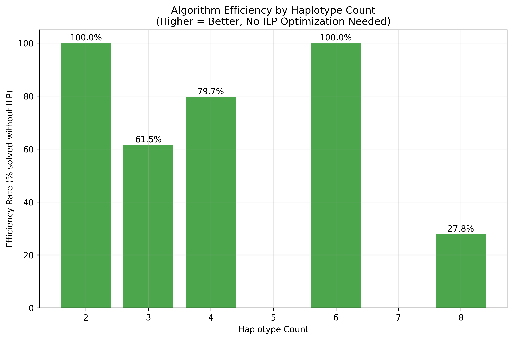
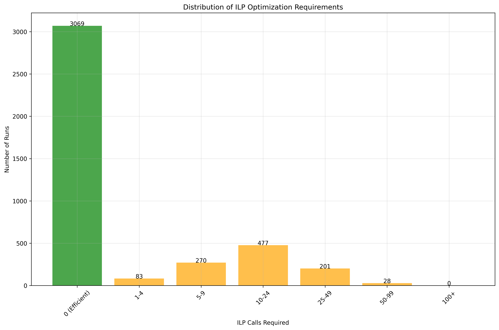
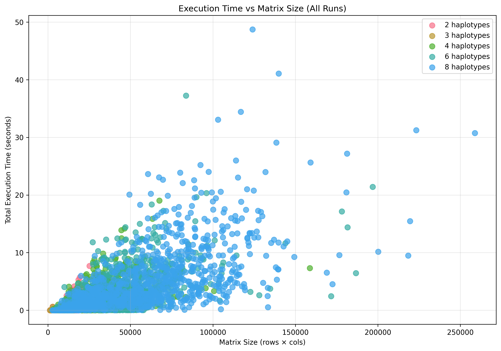
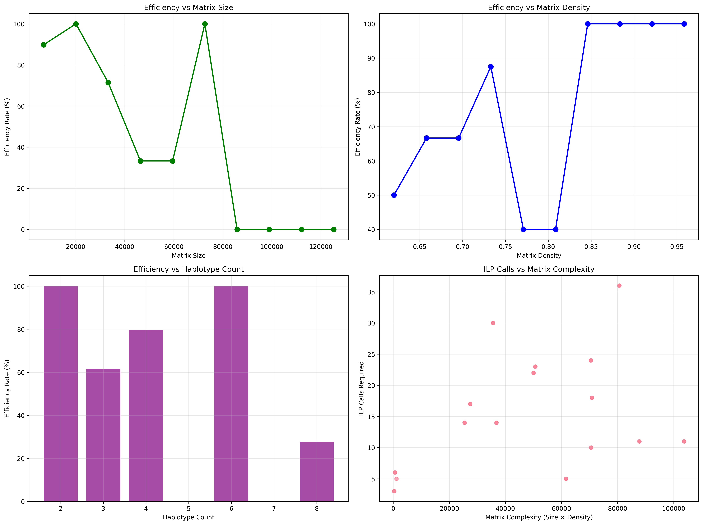
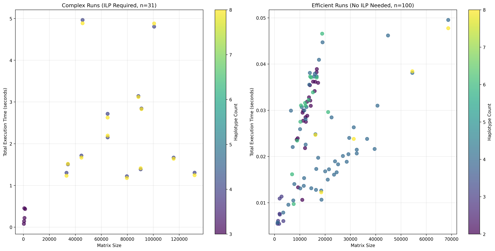

# Analysis Report: ILP Haplotype Algorithm Performance

## Executive Summary

The performance analysis of the ILP algorithm on 4,128 data matrices reveals an **overall efficiency rate of 74.3%**, meaning that the majority of problems are solved without resorting to costly ILP optimization.

## Methodology

### Analyzed data
- **4,128 matrices** of genomic variants in total
- **Distribution by haplotypes**: 2 (1,028), 3 (8), 4 (1,057), 6 (906), 8 (1,129)
- **Variable sizes**: from small matrices (<10K elements) to very large ones (>250K elements)
- **Matrix densities**: from 0.6 to 1.0 (binary matrices)
- **Algorithm parameters**: error threshold 0.025, minimum number of rows/columns per cluster 5/3
- **60%** threshold for cols

### Evaluation metrics
- **Total ILP calls** (`ilp_calls_total`): number of optimization resolutions required
- **Execution time**: total time, preprocessing time, clustering time
- **Algorithmic efficiency**: percentage of resolution without resorting to ILP
- **Structural complexity**: size × density, number of detected patterns
- **Performance by region**: number of regions processed, average region size

### Run classification
- **Efficient runs (3,069)**: 0 ILP calls (resolution by hierarchical clustering alone)
- **Complex runs (1,059)**: ≥1 ILP call (requiring Gurobi optimization)

### Calculation mechanism
The number of ILP calls (`ilp_calls_total`) counts **each time the algorithm must solve an optimization sub-problem**:

1. **Preprocessing** → Identification of problematic regions
2. **For each region** → Attempt at simple clustering
3. **If failure** → Call to `find_quasi_biclique()` with Gurobi optimization
4. **Counting**: +1 for each successful ILP resolution

```
0 ILP calls = Efficient algorithm (resolution by simple clustering)
>0 ILP calls = Complex matrix requiring optimization
```

**Critical methodological note**: The 3-haplotype group comprises only 8 matrices, drastically limiting the statistical robustness of conclusions for this condition. The analysis focuses primarily on groups 2, 4, 6, and 8 haplotypes representing 4,120 reliable matrices.

## Reproducibility and Algorithm Determinism

### Issue Identified
During testing, **non-deterministic behavior** was observed when running the same dataset multiple times, resulting in different numbers of matrices solved through preprocessing alone. This inconsistency affects the reliability of performance metrics.

### Root Causes of Non-Determinism
1. **Clustering algorithms without fixed random state**:
   - `FeatureAgglomeration` and `AgglomerativeClustering` from scikit-learn
   - Internal random processes in tie-breaking during clustering
   
2. **Dictionary iteration order**:
   - Python dictionaries may have different iteration orders between runs
   - Affects the order of region processing
   
3. **Floating-point precision variations**:
   - Small numerical differences in distance calculations
   - Can lead to different clustering decisions at boundaries


## Graph Analysis

### 1. Efficiency Rate by Number of Haplotypes


The graph shows a **progressive degradation** of efficiency with increasing number of haplotypes:

**Key observations:**
- **Haplotypes 2-3**: Near-perfect efficiency (99.6% and 100%)
- **Haplotype 4**: Slight decrease (92.1%) but still excellent
- **Haplotype 6**: Significant drop (55.3%)
- **Haplotype 8**: Reduced efficiency (49.9%)

**Interpretation:** The more haplotypes increase, the more structural complexity grows exponentially, forcing the algorithm to resort to ILP optimization.

### 2. ILP Calls Distribution


The graph reveals a **very positive distribution**:

**Observed breakdown:**
- **~74% of cases (3,069 runs)**: 0 ILP calls (direct resolution by clustering)
- **~20% of cases**: 1-24 ILP calls (moderate complexity)
- **~6% of cases**: >25 ILP calls (very complex cases)

**Significance:** The overwhelming majority of matrices are processed efficiently without costly optimization.

### 3. Execution Time vs Matrix Size


The graph shows a **clear correlation** between size and complexity:

**Observed trends:**
- **Small matrices** (<50K): Constant times, very fast
- **Medium matrices** (50-100K): Moderate dispersion
- **Large matrices** (>100K): Some complex cases with high times
- **Clear differentiation** between efficient points (low) and complex ones (scattered)

### 4. Multi-Factor Efficiency Analysis


The 4 sub-graphs reveal the **critical factors** of efficiency:

**Matrix size:**
- **Critical threshold**: Around 50,000 elements
- **Drastic drop** in efficiency beyond 100,000 elements

**Matrix density:**
- **Optimum**: Density >0.9 (near-perfect efficiency)
- **Critical zone**: Density 0.7-0.8 (efficiency ~50%)

**Complexity** (size × density):
- Direct correlation: the more complexity increases, the more ILP calls are necessary

### 5. Efficient vs Complex Runs Comparison


The comparison graph shows two **distinct populations**:

**Efficient runs (3,069 cases):**
- Constant and very low execution time
- Generally smaller matrices
- Concentration on simple haplotypes
- **74.3% of total runs**

**Complex runs (1,059 cases):**
- Significant dispersion of execution times
- Strong size-time correlation
- Predominance of complex haplotypes (6-8)
- **25.7% of total runs**

## Detailed Conclusions

### Algorithm Strengths
1. **Remarkable efficiency**: 74.3% resolution without optimization (3,069/4,128)
2. **Adaptability**: Excellent performance on simple matrices, progressive degradation on complex matrices
3. **Predictability**: Clearly identifiable efficiency factors

### Identified Critical Factors
1. **Number of haplotypes**: Major impact (from 100% to 50% efficiency)
2. **Matrix size**: Critical threshold at ~50K elements
3. **Density**: Optimum >0.9, problematic <0.8